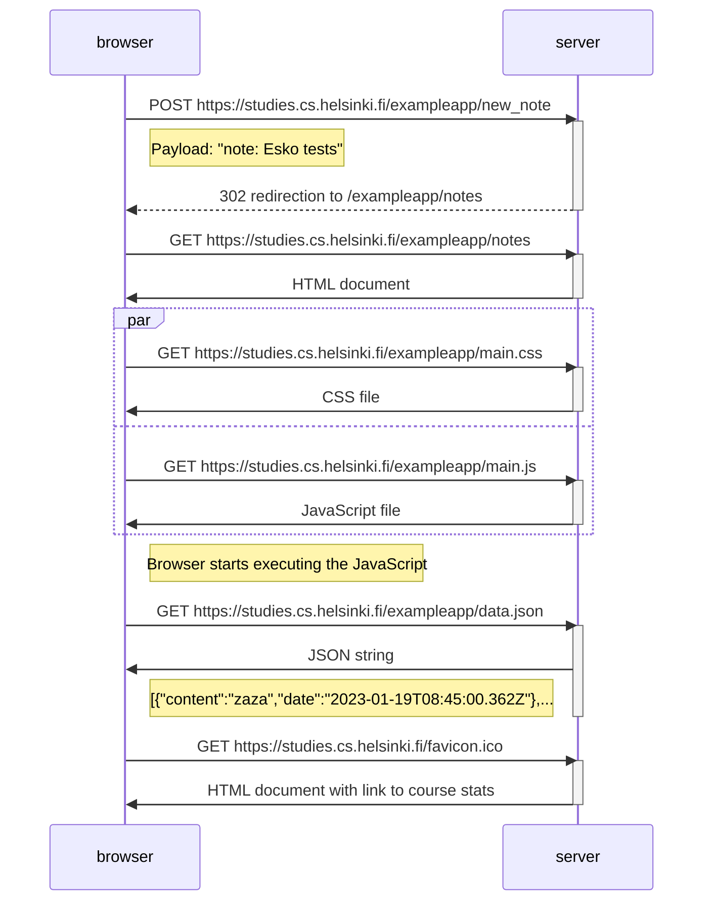

Exercise 0.4 from https://fullstackopen.com/en/part0/fundamentals_of_web_apps

```mermaid

sequenceDiagram
    participant browser
    participant server

    browser->>server: POST https://studies.cs.helsinki.fi/exampleapp/new_note
    activate server
    Note right of browser: Payload: "note: Esko tests"
    server-->>browser: 302 redirection to /exampleapp/notes
    deactivate server

    browser->>server: GET https://studies.cs.helsinki.fi/exampleapp/notes
    activate server
    server->>browser: HTML document
    deactivate server

    par
    browser->>server: GET https://studies.cs.helsinki.fi/exampleapp/main.css
    activate server
    server->>browser: CSS file
    deactivate server

    and
    browser->>server: GET https://studies.cs.helsinki.fi/exampleapp/main.js
    activate server
    server->>browser: JavaScript file
    deactivate server
    end

    Note right of browser: Browser starts executing the JavaScript

    browser->>server: GET https://studies.cs.helsinki.fi/exampleapp/data.json
    activate server
    server->>browser: JSON string
    Note left of server: [{"content":"zaza","date":"2023-01-19T08:45:00.362Z"},...
    deactivate server

    browser->>server: GET https://studies.cs.helsinki.fi/favicon.ico
    activate server
    server->>browser: HTML document with link to course stats
    deactivate server

```